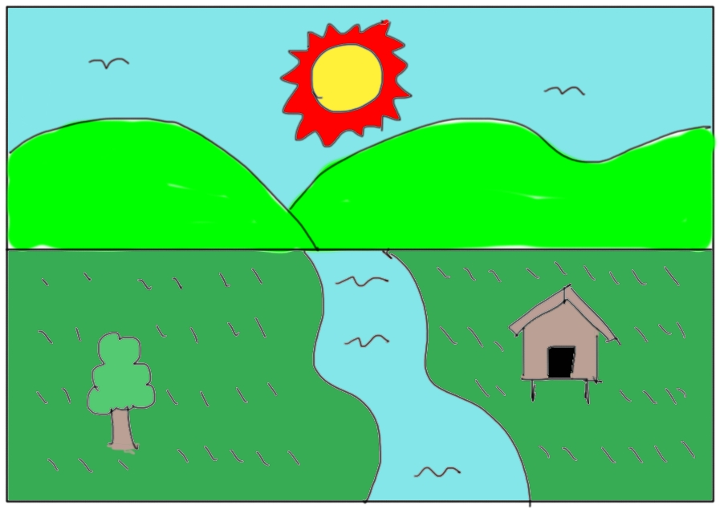
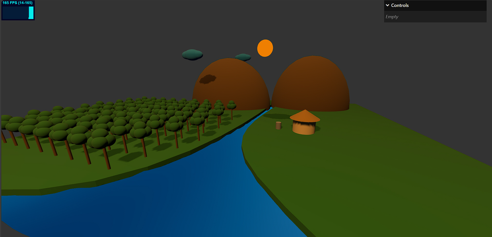

# Assignment 02 : 3D graphic (Three.js)

> **เป้าหมาย:** วาดภาพทิวทัศน์ด้วย **HTML5 JavaScript Three.js** ตามที่เรียนใน Week04–Week05 โดยใช้ model จากไฟล์ glTF/glb ได้ (เช่น ต้นไม้/บ้าน)

---

## สรุปงาน (อ่านก่อนเริ่ม)
- วาดฉากทิวทัศน์ 3D ด้วย Three.js
- **องค์ประกอบที่ต้องมีครบ 6 อย่าง**
  1) ภูเขา 
  2) พระอาทิตย์
  3) ท้องนา
  4) ต้นไม้
  5) บ้าน/กระท่อม
  6) แม่น้ำ
- **อนุญาติ** ใช้ model จากไฟล์ glTF/glb ได้ (เช่น ต้นไม้/บ้าน)
- ส่ง **ลิงก์ GitHub repo** + **ลิงก์วิดีโออธิบาย ≥ 5 นาที** ผ่าน Google Form (อาจารย์จะแจ้งลิงก์ในกลุ่ม)

> แรงบันดาลใจ: ดูภาพตัวอย่างใน `sample.jpg`, `sample_3d.jpg` ได้ แต่ไม่ต้องวาดเหมือน 100% ออกแบบเองได้
> <br>
> 

## โครงสร้างไฟล์ขั้นต่ำของโปรเจกต์ (ของนักศึกษาตอนส่งงาน)
```
/ (root)
├── index.html ← แสดงรหัสนักศึกษา+ชื่อ+กลุ่ม
├── index.js ← โค้ดงาน
├── README.md ← เขียนอธิบายวิธีรัน + แนวคิดสั้น ๆ + ลิงก์วิดีโอ (YouTube)
├── utils-module.js ← ไฟล์จากอาจารย์ (ถ้าใช้)
└── ไฟล์อื่นๆ (เช่น glb, gltf, jpg, png, obj, mtl ฯลฯ)
```

---

### Starter code

นักศึกษาใช้ starter code จาก repository ที่อาจารย์ให้ไว้ ใน repo นี้ และแก้ไขไฟล์ index.js เริ้มที่ TODO: ได้เลย ตามโจทย์ พร้อมจัดโครงสร้างไฟล์ให้ตรงกับที่กำหนดด้านบน

---

## วิธีรันงาน (เลือกอย่างใดอย่างหนึ่ง)
**วิธีที่ 1 (ง่ายสุด):** ดับเบิลคลิก `index.html` เพื่อเปิดในเบราว์เซอร์

**วิธีที่ 2 (แนะนำใน VS Code):** ติดตั้งส่วนเสริม *Live Server* → คลิกขวา `index.html` → *Open with Live Server*

---

## เกณฑ์ให้คะแนน (100 คะแนน + โบนัส 20)
- **ครบ 6 องค์ประกอบ** — 40 คะแนน  
- **ใช้ Three.js ตามที่เรียน** (mesh/scene/camera ฯลฯ) — 20 คะแนน  
- **องค์ประกอบภาพ/ความเป็นระเบียบ** — 15 คะแนน  
- **โครงสร้างโค้ดดี** (แยกฟังก์ชัน/อ่านง่าย/มีคอมเมนต์พอดี) — 15 คะแนน  
- **README มีคุณภาพ** (วิธีรัน/แนวคิด/ลิงก์วิดีโอ) — 5 คะแนน  
- **วิดีโออธิบาย ≥ 5 นาที** (ครบหัวข้อ) — 10 คะแนน  
- **โบนัสแอนิเมชันสมเหตุผล** — 0–20 คะแนน (เมฆลอย, แสงเปลี่ยน, น้ำไหล ฯลฯ)

**ตัดศูนย์กรณี:** โค้ดรันไม่ได้เลย

---

## วิดีโออธิบาย (≥ 5 นาที ต้องมี)
1) แนะนำตัวสั้น ๆ  
2) โชว์ผลลัพธ์ที่รันจริง  
3) อธิบายลำดับโค้ดส่วนสำคัญ → ผลที่เกิด  
4) แก้โค้ดเล็กน้อยแล้วโชว์ผลต่าง (เช่น เปลี่ยนสี/ตำแหน่ง/ความเร็วเมฆ)  
5) สรุปสิ่งที่เข้าใจ/ทักษะที่ได้

> วางลิงก์วิดีโอไว้ใน `README.md` ของ repo ด้วย

---

## การใช้ AI
อนุญาตให้ใช้เป็นผู้ช่วยค้นคว้า/ขอคำอธิบาย แต่ **นักศึกษาต้องอธิบายโค้ดของตนเองได้** หากอาจารย์สุ่มถาม (ตอบไม่ได้ มีผลต่อคะแนน “ความเข้าใจโค้ด”)

---

## การส่งงาน
1) สร้าง GitHub repo ชื่อ `comp281-assignment2-รหัสนักศึกษา` (เช่น `comp281-assignment2-671122335`)
2) อัปโหลดโค้ด + เติม `README.md` (ใส่ลิงก์วิดีโอ)
3) ส่งลิงก์ GitHub + ลิงก์วิดีโอ ผ่าน **Google Form** (อาจารย์จะแจ้งลิงก์ในกลุ่ม)

---

## เช็กลิสต์ก่อนส่ง
- [ ] มีองค์ประกอบครบทั้ง 6 อย่าง  
- [ ] โค้ดรันได้จริง (เปิดหน้าเว็บแล้วเห็นภาพครบ)  
- [ ] โครงสร้างโค้ดอ่านง่าย แยกฟังก์ชันพอเหมาะ มีคอมเมนต์สั้น ๆ  
- [ ] README ระบุวิธีรัน + ใส่ลิงก์วิดีโออธิบาย  
- [ ] วิดีโอ ≥ 5 นาที และมี “แก้โค้ดแล้วผลต่าง” ให้เห็นชัด

---

## Q&A (คำถามพบบ่อย)
**Q: ใช้ model จากไฟล์ glTF/glb ได้ไหม?**  
A: **ได้** แต่ต้องไม่ใช่ทั้งฉาก หากเป็น model ต้นไม้/บ้าน/กระท่อม แบบแยกชิ้นได้จะดีมาก

**Q: อยากเพิ่มรายละเอียด/วัตถุอื่น ๆ ได้ไหม?**  
A: ได้เลย เพิ่มได้เต็มที่ แต่อย่าทำให้ภาพรก อ่านยาก หรือทำให้เฟรมเรตตกหนัก

**Q: Animation ต้องมีไหม?**  
A: ไม่บังคับ แต่มีจะได้ **โบนัส 0–20 คะแนน** หากสมเหตุผลและลื่นไหล

**Q: วัด “โครงสร้างโค้ดดี” ยังไง?**  
A: ดูการแยกฟังก์ชัน ชื่อสื่อความ การเว้นวรรค/จัดบล็อก คอมเมนต์พอดี ไม่สั้นไปไม่ยาวไป

---

**ขอให้สนุกกับการวาดฉากด้วย Three.js!** ✨ หากติดขัดให้ย้อน Week04–Week05 ก่อน แล้วค่อยถามในกลุ่มได้